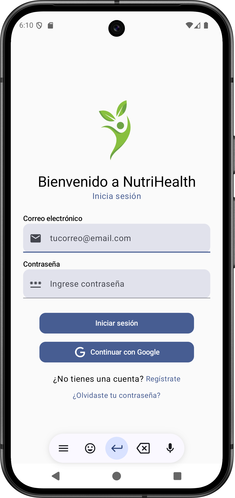
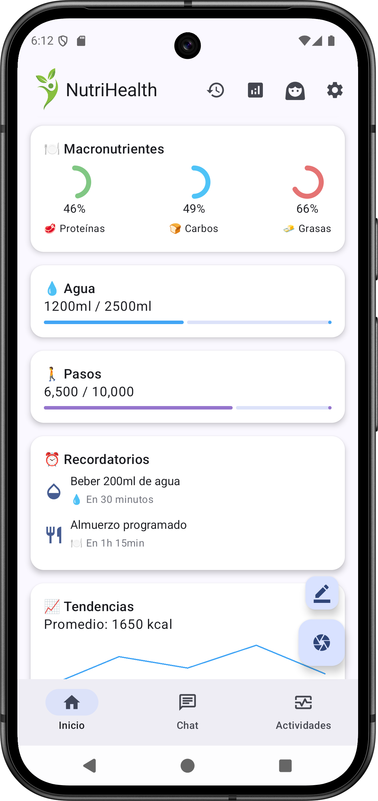
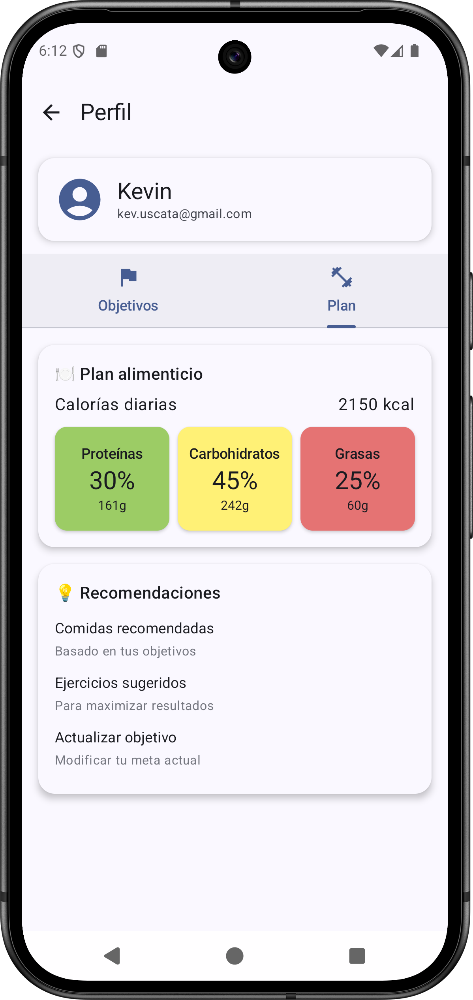

# NutriHealth

NutriHealth es una aplicación para la gestión nutricional y de actividades físicas.

## Características

- Scanner de comida impulsado por IA
- Seguimiento de actividad física a través de un mapa
- Visualización de datos

## Librerías utilizadas

- Firebase para la conexión con los servicios de autenticación, base de datos e IA
- Hilt para facilitar la inyección de dependencias
- Retrofit para la comunicación con servicios HTTP
- Vico para la presentación de datos en formato de dashboards

# Capturas de pantalla

[//]: # (![image]&#40;img/login.png =250X&#41;)
[//]: # (![image]&#40;img/main.png =250X&#41;)
[//]: # (![image]&#40;img/profile.png =250X&#41;)
